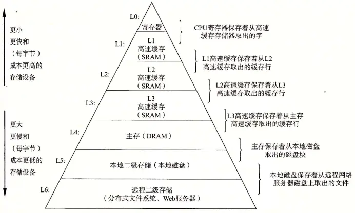
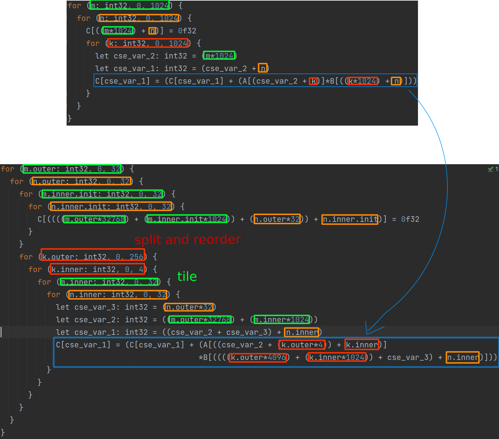
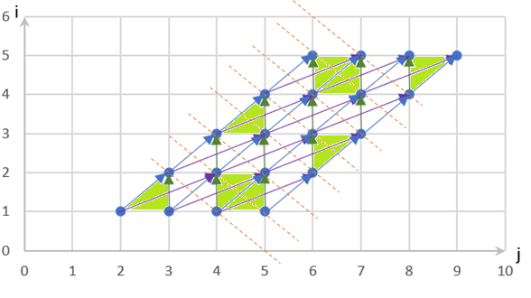
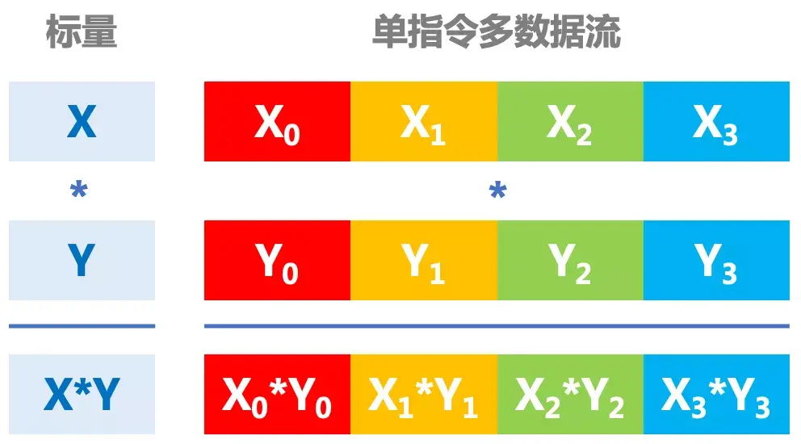
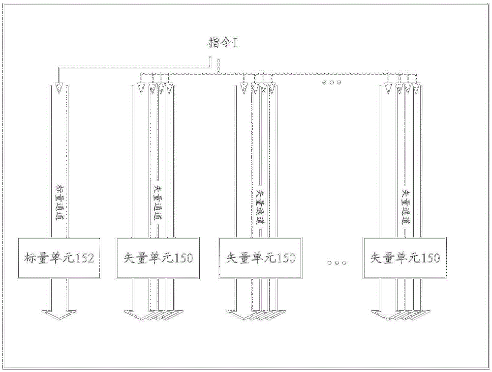

## 算子编译器（扩展部分）

算子编译器，顾名思义，即对“单个算子”进行编译优化的工具。这里所谓的“单个算子”可以来自于整个神经网络中的一部分，也可以来自于通过[领域特定语言（Domain Specific Language, DSL）](https://en.wikipedia.org/wiki/Domain-specific_language)实现的代码。而所谓编译，通俗来说起到的是针对目标语言进行**表达**和**转换**。

从目的上来说，算子编译器致力于提高单个算子的**执行性能**。从工程实现上来说，算子编译器的输入一般为python等**动态语言**描述的张量计算，而输出一般为**特定AI芯片**上的可执行文件。

针对上述两个方面，我们继续进行深入思考。

### 算子调度策略

算子编译器为了实现较好地优化加速，会根据现代计算机体系结构特点，将程序运行中的每个细小操作抽象为“调度策略”。
如果不考虑优化和实际中芯片的体系结构特点，我们只需要按照算子表达式的**计算逻辑**，把输入进来的张量全部加载进计算核心里完成计算，之后再把计算结果从计算核心里面取出并保存下来即可。这里的**计算逻辑**指的就是基本数学运算（如加、减、乘、除）以及其他函数表达式（如卷积、转置、损失函数）等。


:width:`800px`
:label:`memory_architecture`

但事实上，受限于计算机的造价问题，:numref:`memory_architecture`向我们展示了现代计算机的内存存储结构。该图表明：越靠近金字塔顶尖的存储器造价越高但是访问速度越快。
基于这一硬件设计的事实，我们有[局部性概念](https://en.wikipedia.org/wiki/Locality_of_reference)： 
1. 时间局部性，相对较短时间内重复访问特定内存位置。如，多次访问L1高速缓存的同一位置的效率会高于多次访问L1中不同位置的效率。
3. 空间局部性，在相对较近的存储位置进行访问。如，多次访问L1中相邻位置的效率会高于来回在L1和主存跳跃访问的效率。
满足这两者任一都会有较好的性能提升。基于局部性概念，我们希望尽量把需要重复处理的数据放在固定的内存位置，且这一内存位置离处理器越近越好，以通过提升访存速度而进行性能提升。


:width:`800px`
:label:`parallel_computing`

另外，我们把传统的串行计算任务按逻辑和数据依赖关系进行分割后，有机会得到多组互不相关的数据，并把他们同时计算，如图:numref:`parallel_computing`所示。
以上种种在程序实际运行的时候针对数据做出的特殊操作，我们统称为**调度（schedule）策略**。

MIT CASIL组的[Jonathan Ragan-Kelley](http://people.csail.mit.edu/jrk/)在2013年发表的文章 :cite: `ragan2013halide`中给出了schedule的精确定义：
1. 应该在何时何处计算函数中的每个值？
2. 数据应该储存在哪里？
3. 每个值在多个消费者（consumer，指使用这些值进行计算的其他值）之间访存需要花费多长时间？另外在何时由每个消费者独立重新计算？

通俗理解，调度策略指的是：在编译阶段根据目标硬件体系结构的特点而设计出的一整套通过提升局部性和并行性而使得编译出的可执行文件在运行时性能最优的算法。这些算法并不会影响计算结果，只是干预计算过程，以达到提升运算速度的效果。

#### 子策略组合优化

算子编译器的一种优化思路是：将抽象出来的调度策略进行组合，拼接排布出一个复杂而高效的调度集合。本文以[TVM](https://github.com/apache/tvm)为例，通过在CPU上加速优化一段实际代码，简要介绍其中几种基本调度策略组成的优化算法。

假设我们有以下形式为乘累加计算的输入代码。该计算逻辑为：张量A与张量B相乘后，结果累加到张量C中。

```c
for (m: int32, 0, 1024) {
  for (n: int32, 0, 1024) {
    C[((m*1024) + n)] = 0f32
      for (k: int32, 0, 1024) {
        let cse_var_2: int32 = (m*1024)
          let cse_var_1: int32 = (cse_var_2 + n)
            C[cse_var_1] = (C[cse_var_1] + (A[(cse_var_2 + k)]*B[((k*1024) + n)]))
      }
  }
}
```

假定数据类型为浮点型（float），此时张量A、B、C的大小均为`1024 * 1024`，三者占用的空间共为`1024 * 1024 * 3 * sizeof(float) = 12MB`。这远远超出了常见缓存的大小（如L1 cache为32KB）。因此按照此代码形式，要将整块张量A、B、C一起计算，只能放入离计算核更远的内存进行计算。其访存效率远低于缓存。

为了提升性能，我们提出使用平铺（tile），循环移序（reorder）和切分（split）的调度策略，对于`m`循环和`n`循环都按照大小为32的因子（factor）进行平铺，对于`k`循环按照大小为4的因子进行切分，最后将切出的`k`循环移动到合适位置。经过该策略优化过程示意图及优化后的代码如图:numref:`tvm_schedule`所示：


:width:`800px`
:label:`tvm_schedule`

这里我们重点看第8-19行的核心计算语句。每次计算时只需要关注`m.inner * n.inner`构成的小块（block）即可，而其他的外层循环不会影响最内层小块的访存。其占用内存大小为`32 * 32 * 3 * sizeof(float) = 12KB`，足够放入cache中。

本示例参照TVM提供的[在CPU上优化矩阵乘运算的实例教程](https://tvm.apache.org/docs/how_to/optimize_operators/opt_gemm.html#)中的第一项优化，读者可深入阅读后续优化内容。

#### 多面体模型优化

算子编译器的另外一种优化思路是：将代码的多层循环抽象为多维空间，将每个计算实例抽象为空间中的点，实例间的依赖关系抽象为空间中的线，以多面体模型编译（polyhedron compilation）技术 :cite:`grosser2011polly`主要对`for`循环进行优化。该算法的主要思想是针对输入代码的访存特点进行建模，调整 for 循环语句中的每一个实例的执行顺序，使得新调度下的 for 循环代码有更好的局部性和并行性。

假设我们有以下形式的代码：

```c
for (int i = 0; i < N; i++)
  for (int j = 1; j < N; j++)
    a[i+1][j] = a[i][j+1] - a[i][j] + a[i][j-1];
```


:width:`800px`
:label:`poly_rest`

通过多面体模型算法先对此代码进行访存建模，如图:numref:`poly_rest`所示。再进行复杂的依赖分析和调度变换之后得到一个符合内存模型的最优解，生成的代码为：

```c
for (int i_new = 0; i_new < N; i_new++)
  for (int j_new = i+1; j_new < i+N; j_new++)
    a[i_new+1][j_new-i_new] = a[i_new][j_new-i_new+1] - a[i_new][j_new-i_new] + a[i_new][j_new-i_new-1];
```

观察得到的代码，发现优化后的代码较为复杂。但是仅凭肉眼很难发现其性能优势之处。仍需对此优化后的代码进行如算法描述那样建模，并分析依赖关系后得出结论，如图:numref:`poly_result`所示：经过算法优化后解除了原代码中的循环间的依赖关系，从而提高了并行计算的机会。即沿着图中虚线方向分割并以绿色块划分后，可以实现并行计算。
该算法较为复杂，限于篇幅，在这里不再详细展开。读者可移步到笔者专门为此例写的文章-[深度学习编译之多面体模型编译——以优化简单的两层循环代码为例](https://zhuanlan.zhihu.com/p/376285976)详读。


:width:`800px`
:label:`poly_result`

除了核心的优化任务之外，还有两方面值得简要一提。

### 芯片指令集适配

前文讲述了算子编译器的优化方法，本小节将阐述算子编译器适配不同芯片上指令集的情况。一般意义上来说，通用编译器的设计会尽量适配多种后端。如此一来，在面临不同体系结构特点和不同编程模型的多种后端时，算子编译器承受了相当大的压力。

当下的AI芯片中，常见的编程模型分为：[单指令多数据（Single instruction, multiple data, SIMD）](https://en.wikipedia.org/wiki/Single_instruction,_multiple_data)，即单条指令一次性处理大量数据，如图:numref:`SIMD`所示；[单指令多线程（Single instruction, multiple threads, SIMT）](https://en.wikipedia.org/wiki/Single_instruction,_multiple_threads)，即单条指令一次性处理多个线程的数据，如图:numref:`SIMT`所示。前者对应的是带有向量计算指令的芯片，比如华为的昇腾系列芯片等；后者对应的是带有明显的线程分级的芯片，比如英伟达的V系列和A系列芯片等。另外，也有一些芯片开始结合这两种编程模型的特点，像寒武纪的思元系列芯片，既有类似线程并行计算的概念，又有向量指令的支持。针对不同的编程模型，算子编译器在进行优化（如向量化等）时的策略也会有所不同。


:width:`800px`
:label:`SIMD`


:width:`800px`
:label:`SIMT`

一般来说，算子编译器在具体的代码中会从按照：前端、中端、后端，逐渐差异化的思路进行实现。即在前端设计中兼容多种不同芯片后端的指令集，以帮助编译器用户（即AI程序员）不需要在乎芯片差异，而只需要专注在AI算法逻辑上即可；在中间表示（IR）设计中对不同芯片的体系结构进行区分，从而可以实现对不同芯片进行不同的优化方法；在后端的目标代码生成部分对各个芯片的不同指令集详细区分，以保证生成出的目标代码能够顺利运行在目标芯片上。

### 算子表达能力

算子表达能力指的是：算子编译器的前端识别输入代码，并在不损失语义信息的情况下转换为中间表示（IR）的能力。算子编译器承接的前端输入往往是[pytorch](https://github.com/pytorch/pytorch)等的python形式的代码，而python中各种灵活的表达方式（包括而不限于索引、view语义等）对算子编译器的前端表达能力提出了较高要求。另外在检测网络中，输入算子往往还有大量的控制流语句。此外，还经常可以看到神经网络中存在许多的动态形状问题，即网络中的算子形状会受网络迭代次数和控制流等条件的影响。这些都对算子编译器前端的表达能力提出了很高的要求。

在实际工程实践中，我们发现大量的长尾分布般不常见但性能很差的算子（后文简称为长尾算子）往往是整体网络训练或推理的瓶颈点。而这些长尾算子大都是由于其出现频次低而不至于实现在计算库中。同时其语法过于灵活或存在大量的控制流语句以及动态形状问题而难以被目前的算子编译器前端充分表达出来，因此也难以通过算子编译器进行优化加速。于是，这些长尾算子只好以运行速度较慢的python解释器或者虚拟机的方式执行，从而成为整个网络中的性能瓶颈。此时，提高算子编译器前端的表达能力就成为了重中之重。

### 相关编译优化技术

算子编译器与传统编译器在优化技术方面根出同源，但由于面对的问题不同，所以在优化思路上也有差别。两者都以前中后端的思路进行设计，都是以增强局部性和并行性为优化的理论依据。
但是前者面向的问题是AI领域中的计算问题，往往在优化过程中会大量参考和借鉴高性能计算（HPC）的优化思路，这种情况我们称为借助专家经验进行优化。另外算子编译器面对的后端AI芯片的体系结构的不同，如重点的单指令多数据和单指令多线程为代表的两种后端体系结构，决定了优化过程中更多偏向于生成对单指令多数据友好的加速指令，或者生成对单指令多线程友好的多线程并行计算模型。
而后者面向的问题是更加通用的标量计算行为和计算机控制命令，往往在优化中围绕寄存器的使用和分支预测准确性等进行优化。
总之，由于需要解决的问题不同，算子编译器和传统编译器在优化算法的具体实现上有着一定的区别，但是在算法设计时也有互相借鉴的机会。